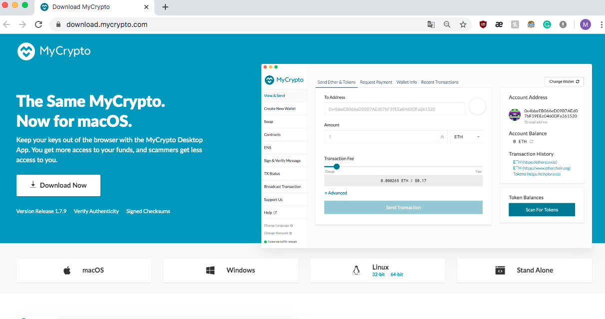

## Installing MyCrypto Desktop App

[MyCrypto](https://www.mycrypto.com/) is a free, open-source, client-side interface that allows you to interact directly
with the blockchain.

To install MyCrypto Desktop App, please follow the next steps:

1. Open your browser and navigate to the downloads page at https://download.mycrypto.com/.

2. Depending on your operating system, you will be redirected to the corresponding application installer.If you are not correctly redirected, choose the appropriate installer for your operating system.

3. Once you download the installer, open the file, and follow the installation wizard.

## Installing Go Ethereum Tools

[Go Ethereum](https://geth.ethereum.org/) is one of the three original implementations of the Ethereum protocol. It is written in Go, fully open-source and licensed under the GNU LGPL v3.

Despite there are installers for OS X and Windows, we will use the application executable binary files to have a seamless experience between both operating systems and avoid some technical issues that currently exist in Windows.

To install the Go Ethereum Tools, please follow the next steps:

1. Open your browser and navigate to the Go Ethereum Tools download page at https://geth.ethereum.org/downloads/

2. Scroll down to the "Stable Releases" section and proceed depending on your operating system.

 2.1. Installing in OS X.
 Click on the **"Geth & Tools 1.9.13"** **or the latest** to download the applications bundle archive.
 

 2.2. Installing in Windows.
 
 You need to know if you are running a `32 bit` or `64 bit` version of Microsoft Windows.

 Depending on your Windows version, you should download the `32 bit` or `64 bit` version of the Go Ethereum Tools.

3. After downloading the tools archive, open your "Downloads" folder, and you will find a file named `geth-alltools-darwin-amd64-1.9.13-a718daa6.tar.gz` in OS X, and a file called `geth-alltools-windows-amd64-1.9.13-a718daa6.zip` in Windows. Note that the last numbers in the filename could vary depending on the last built available.

4. Decompress the archive in the location of your preference in your computer's hard drive, and rename the containing folder as `Blockchain-Tools`. We recommend using a location that can be easily accessed from the terminal window like the user's home directory.

5. You have finished the installation process; you will use these tools to create your very own blockchain!
