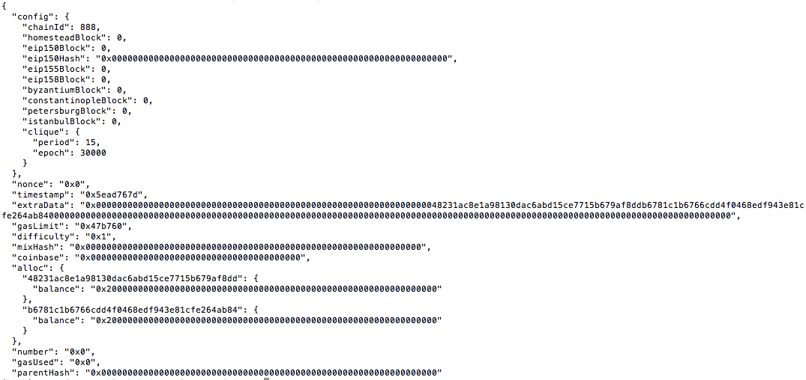

Now you are going to connect MyCrypto with the blockchain you created. Follow the next steps.

* Open up MyCrypto app, then click `Change Network` at the bottom left:

 

* Click "Add Custom Node", then add the custom network information that you set in the genesis.
 

* Make sure that you scroll down to choose `Custom` in the "Network" column to reveal more options like `Chain ID`:

 

* The chain ID must match Zbank chain ID.
 

* The URL is pointing to the default RPC port on your local machine. Use `http://127.0.0.1:8545`.

* Once you save and use the network, double-check that it is selected and is connected.

### Send a test transaction

* Click `view and send` and then click `private key`
 

* Import the keystore file from the `node1/keystore` directory into MyCrypto. This will import the private key.

* Send a transaction from the `node1` account to the `node2` account.

* Copy the transaction hash and paste it into the "TX Status" section of the app, or click "TX Status" in the popup.

