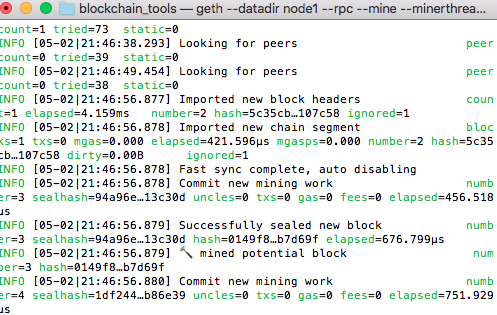
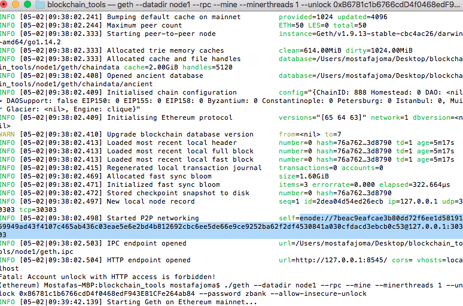

# ZBank-Blockchain
Private BlockChain testnet for developer team to use and explore potentials for blockchain at ZBank.

## Requirements  
1. MyCrypto Desktop App

2. Go Ethereum Tools

Please **refere to installation-guide.md** for complete intstallation guide

## How to start the Network

* `node1` will be a full node that is mining that exposes an RPC port, allowing you to talk to it with other apps like MyCrypto..

* `node2` will be a full node that is also mining. 

### Instructions

Open a terminal window (Git Bash in Windows) navigate to your `Blockchain-Tools` folder and follow the next steps.

* Launch the first node into mining mode with the following command:

 ```bash
 ./geth --datadir node1 --rpc --mine --minerthreads 1 --unlock `node 1 private key`  --password password.txt --allow-insecure-unlock
 ```
 * The `--rpc` flag enables us to talk to our second node, which will allow us to use MyCrypto or Metamask to transact on our chain.

 * The `--mine` flag tells the node to mine new blocks.

 * The `--minerthreads` flag tells `geth` how many CPU threads, or "workers" to use during mining. Since our difficulty is low, we can set it to 1.
 
 * `--unlock --password` tells the node to unlock this account, with the password in that file and to start mining.
 
 
You should see the node `Committing new mining work`:



Now you will launch the second nodee.

* Scroll up in the terminal window where `node1` is running, and copy the entire `enode://` address (including the last `@address:port` segment) of the first node located in the `Started P2P Networking` line:

 

* We will need this address to tell the second node where to find the first node.

* Open another terminal window and navigate to the same directory as before. `Blockchain-Tools`

* Launch the second node, change the sync port, and pass the `enode://` address of the first node in quotes by running the following command (it will differ in Windows and OS X):

 * Running in OS X:
 ```bash
 ./geth --datadir node2 --port 30304 --mine --minerthreads 1 --bootnodes "enode://<replace with node1 enode address>" --unlock `node 1 private key` --password password.txt --allow-insecure-unlock
 
 ```

 * Running in Microsoft Windows:
 ```bash
 ./geth --datadir node2 --port 30304 --minerthreads 1  --bootnodes "enode://<replace with node1 enode address>" --ipcdisable
 ```
 
  * The output of the second node should show information about `Importing block segments` and synchronization.

 * Since the first node's sync port already took up `30303`, we need to change this one to `30304` using `--port`.

 * The `--bootnodes` flag allows you to pass the network info needed to find other nodes in the blockchain. This will allow us to connect both of our nodes.

 * In Microsoft Windows, we need to add the flag `--ipcdisable` due to the way Windows spawns new IPC/Unix sockets doesn't allow for having multiple sockets running from `geth` at once. 

 
 
 
 ## Hints

* If you ever encounter strange errors, or need to start over without destroying the accounts, run the following command to clear the chain data (this will reset the `enode` addresses as well):

  ```bash
  rm -Rf node1/geth node2/geth
  ```
  
